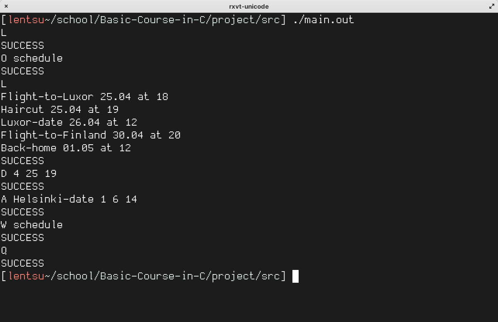

# A scheduling program made as a school project

## Description:

The command-line program manages a linked list of meetings in local memory through user provided commands. Features include adding a meeting, deleting a meeting, printing all the meetings to stdout, writing all the meetings into a file and reading meetings from a file. The project was limited to 2 files: project.c source file and project.h header file.

Commands have the following form:

`<command-label> <args>\n`

Where `<command-label>` is an upper case character for the command and `<args>` is a null terminated string of whitespace separated arguments. 

## Commands:

### A <meeting-name> <month> <day> <hour>
*Adds a meeting to the given time slot*

`<meeting-name>` is a null terminated string.

`<month>` is an 8 bit integer value in range [1, 12].

`<day>` is an 8 bit integer value in range [1, 31].

`<hour>` is an 8 bit integer value in range [0, 23].

### D <month> <day> <hour>
*Deletes a meeting at a given time*

`<month>` is an 8 bit integer value in range [1, 12].

`<day>` is an 8 bit integer value in range [1, 31].

`<hour>` is an 8 bit integer value in range [0, 23].

### L
*Lists the meetings to stdout*

### W <filename>
*Writes the meetings to a file*

`<filename>` is a null terminated string.

### O <filename>
*Loads meetings from a file*

`<filename>` is a null terminated string.

### Q
*Quits the program.*
